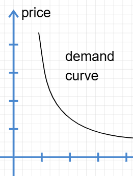
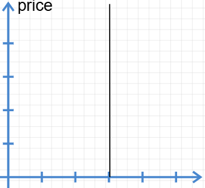
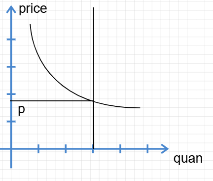
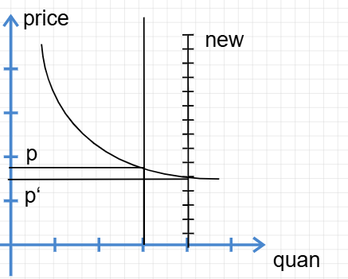
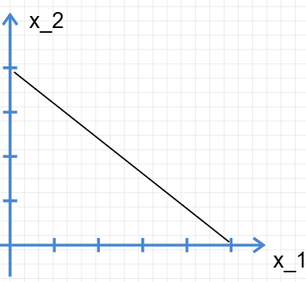

# 微观经济学-消费者理论 I

本小节讲解市场与供求理论。

## 供求曲线认知

### 需求曲线

我们知道消费者对商品消费是有一定的预期的，譬如当猪肉🐖价格达到10000RMB一斤的时候，国家和消费者都会大发雷霆，因为这种价格严重超出消费者心理预期。于是，（至少在大多情况下）消费者将会降低实际对该商品的需求转而选择其他商品。

消费者对商品的**保留价格**和**购买数量**的分布关系构成的 p-n 图像，称为需求曲线

!!! note
	保留价格：某人愿意支付的最高价格

每个消费者都有一个愿意支付的最高价格（保留价格）。当市场价格低于某人的保留价格时，他才会购买。因此，随着价格降低，有能力且愿意购买的人数增多，整个市场的需求量也就增加了。

很显然，随着保留价格的降低，对应的负担的起的租房人数增加。于是，高需求对应较低的价格，低需求对应较高的价格[^1]。

### 供给曲线

相应的，生产者会根据当前的收益、成本、资产与市场状态调整自己的供给与价格。在一个竞争性的市场中，房屋会用不同的价格吸引消费者。

供给曲线就是描绘生产者愿意出手的商品数量与价格之间的关系的曲线。

不过在本模型中，住房市场的房子短时间内是不动的。所以供给曲线在短时间内实际是一条垂直直线：

长期来看，有利可图的话，当然会建造新房。在这种情况下，供给曲线将会**变动**。但是能不能持续呢？用我们目前的水平，不能预测。

### 市场均衡

将供求的曲线放在一起得到市场均衡曲线：

在相交的**均衡点**，市场达到均衡。若有偏移，则供给方会调整自己的价格，或消费者调整自己的需求。如何研究市场的变动？

### 比较静态分析

当市场各个方面开始变化的时候，研究价格等有什么变动。这就是**比较静态分析法**，您可以粗浅地理解为这是控制变量法。

假设多建设了一些房屋：

发现消费者的保留价格得以降低。在平狄克教材中，这被称为“曲线的移动”。因为供给曲线本身就产生了移动。对应的，需求曲线本身没有变动，但是需求曲线的均衡点会“沿需求曲线移动”，因为交点发生了变化。

!!! tip
	范里安举了一个很有意思的例子：如果一部分公寓被改造为私人公寓并出售的情况。在这种情况下，虽然供给减少了，但是需求未必不减少。因为一部分学生可能会选择直接买房（例如本就支付得起500美元租金的人）

??? note "配置住房的其他方法[^3]"
	- 价格歧视垄断者：按照出价高低进行拍卖式的销售，这和市场其实是一样的机制
	- 一般垄断者：按照统一价格出售所有产品，一般来说会刻意降低供给[^2]以收益更多
	- 房租管制：限制房租价格上限。这会使得低支付能力人群能够购买更多消费品。

!!! tip "帕累托效率"
	**帕累托效率**：如果一个政策能够使得所有人（至少一部分人）受益，且其余人的状态**不变差**，那么这个称为得到帕累托改进。还能继续有帕累托改进的配置称为帕累托低效率，否则称为高效率。
	帕累托效率就好比分蛋糕，蛋糕还剩一点，则可以继续进行帕累托改进分给大家；否则已经分配完成，称为帕累托高效率。[^4]

## 预算约束

进入消费者行为的世界。

物理学家假定一个质点只具有运动速度及其质量，便于计算其运动学及动力学特性，这就是抽象。经济学家假定一个消费者只够买两种商品：他想买的商品A和不想买商品A时买的其他商品，这是经济学的抽象[^5]。为了数学描述，我们定义：
$$
\text{消费束：}X=(x_1,x_2)
$$
代表消费者购买商品 $x_1,x_2$ 的元组。

同时，消费者对购买消费品有价格的期望，也有总预算的期望。设总预算为 $m$，商品价格元组为 $(p_1,p_2)$:
$$
p_1 \cdot x_1 + p_2 \cdot x_2 \leq m
$$
这是很简单的高中数学模型。

在 $(p_1,p_2)$ 和总预算 $m$ 下所有负担得起的消费束称为预算集。

### 预算线

预算集的边界就是预算线，即 
$$
p_1 \cdot x_1 + p_2 \cdot x_2 = m
$$
在 $x_1 - x_2$ 坐标中的图像：

实际上就是一个很简单的一次线性函数图像，图像上方的区域无法购买，下方的区域是负担的起的。
$$
x_2 = \frac{m}{p_2}-\frac{p_1}{p_2}x_1
$$
其斜率为 $k=-\frac{p_1}{p_2}$

对约束公式两边同时取微分：
$$
p_1 dx_1 + p_2dx_2 = 0
\\ \Rightarrow \frac{\Delta x_1}{\Delta x_2}=-\frac{p_1}{p_2}
$$
有的经济学教把这个称为计量消费商品1的机会成本，因为放弃消费商品2的机会正式多消费商品1的机会成本。

#### 定性分析预算线的变动

增加收入，增加预算，则向上平行运动。

改变价格，改变斜率，则旋转运动。

!!! note "计价物"
	在经济学模型中，我们要比较价格，通常把其中一种商品的价格定为 **1**，这种商品就叫计价物。

### 税收、补贴和配给政策

政府常见的两种税收手段是**从量税**和**从价税**，前者就是根据购买的量征收相应的税务，后者就是根据商品的价值（价格）而不是数量征收税。例如美利坚联邦汽油税[^6]是从量税，消费税是从价税[^7]。

相对的，补贴就是根据数量或者价格进行金钱的补贴，分为**从量补贴**和**从价补贴**。

然而，政府还可以实行**总额税**、**总额补贴**或配给制度。

#### 配给政策的相应分析

1. 配给

配给供应曲线很好理解，在 $x_1 - x_2$ 曲线中只截取 $[0,x_{\text{max}}]$ 的一部分。

2. 食品券计划：

Food Stamp是一个最为典型的补贴计划，被各个经济学教材广为介绍。1979年食品券进行了改革，此前允许家庭根据其收入情况购买食品券，这实际上等同于一种从价补贴；79年之后，食品券将会直接发放给合乎条件的家庭，实际上等同于一种总额补贴（除了不能出售，因为家庭不能合法贩卖食品券）。[^8]

[^1]: 然而并不是说两者是函数关系，而是分布的关系。这种分布关系由函数关系表征出来。

[^2]: 垄断者的收益设为 $p$，垄断者的出租住房数量设为 $D(p)$，则其总收入为 $p\cdot D(p)$。通常，垄断者若维持 $p^*$ 是不能得到最大化利益的。
[^3]: 即Allocation，配置、分配
[^4]: 然而，有时候蛋糕全部流进资产阶级的手中，而无产者却没有得到足够的生产资料和生活资料。虽然极不公平，但按定义，这仍然满足帕累托最优。帕累托效率只管分配完了没有，不管分配的合理性。他是一个效率的标准而不是一个公平的标准。所以，帕累托最优有其局限性，现亦使用其他最优方式衡量分配的最优性。
[^5]: 当然了，这个模型本就是用于两种商品之间的关系的。因此通常我们用 $x_1-x_2$ 曲线研究两种商品的关系
[^6]: 在2025年1月1日起，新泽西州的税率是：每加仑45美分。这可比范里安书上的数据高多了，看来涨了不少。来自于changechentax.com。
[^7]: 在美国，消费税从0%~10%不等，在中国消费税曾达17%，近年来有所下降。
[^8]: 相应的图片分析参考《微观经济学现代观点》P19。很显然，79年前的补贴使得运算线斜率增大（绝对值减小），之后的补贴使家庭能够直接购买食物因此相应的预算线斜率实际上为0。