# 微观经济学-消费者理论 II

本小节讲解市场与消费者选择。

要点：

- 偏好
- 消费者选择

如前所述，消费束是 $X = (x_1, x_2)$，为消费者选择的目标消费品。

消费者如何选择两种商品的比例？

## 消费者偏好

假设消费者根据意愿对消费束 $X$ 和 $Y$ 进行排序，选择了 $X$，则称消费束 $X$ 是严格偏好于 $Y$，记为 $Y\prec X$。若无差异，则记为 $Y\sim X$ 。同时，如果两个消费束之间有偏好或无差异则记为 $X\preceq Y$。

### 偏好假设

关于偏好模型有一定的假设：

- 完备性公理：消费束是可明确比较的；[^1]
- 反身性公理：消费束不会比自己差；[^2]
- 传递性公理：消费束大小关系可传递$。

### 无差异曲线

将所有偏好相同的消费束 $(x_1,x_2)$ 绘制在 $x_1 - x_2$ 图像中，得到的图像就是一条*无差异曲线*，这意味着该点上所有的消费束对于消费者都是无差异[^4]的。

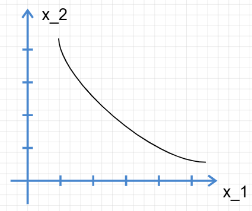

无差异曲线上方表示消费者更偏好的区域，下面表示对消费者更不偏好的区域。

### 偏好的实例

- 完全替代品

如果消费者愿意使用某种比例用商品A替换商品B，那么在这种情况下商品A和B就是完全可以替换的。例如，大学城中售卖的，同样材料与工艺的的黑芯红铅笔和白铅笔，对购买之的大学生基本上是没有差异的，即 $x_1 = k x_2$

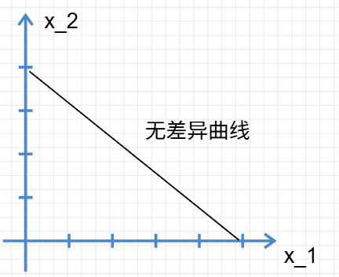

无差异曲线是斜率为 $-k$ 的曲线。[^5]

- 完全互补品

如果消费者购买商品A的同时必须购买相应比例的商品B，则在这种情况下商品AB就称为完全互补品。例如，左右鞋，左右袜，左右手套等各种成套的东西[^6]。

很显然，在 $x_1$ 或 $x_2$ 固定的情况下，增加另一个商品的购买量不会增加偏好，即是无差异的。

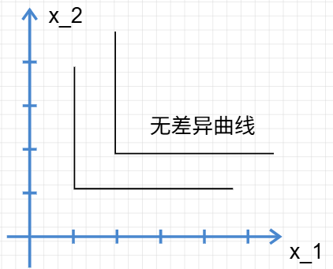

根据多多益善的原则，消费者对右上方的偏好自然更大。

- 厌恶品

名副其实，消费者会尽可能减少对这种商品的购买。假设消费者A喜欢鸡肉而及其厌恶苦瓜[^7]，那么消费者的偏好将会是什么？

消费者每次多购买一点厌恶的苦瓜，就需要得到一点鸡肉作为补偿。所以，消费者的无差异曲线的斜率实际上应当大于0。

特别的，假如两种都是厌恶品，那么增加某一厌恶品需要通过减少另一厌恶品的消费来维持相同效用。

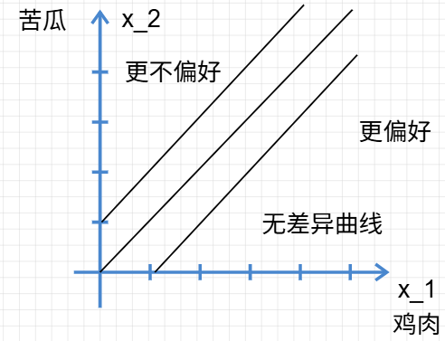

- 中性商品

消费者对其中某种商品毫无偏好。所以曲线要平行于这种商品的坐标轴，相关图像不予给出。

- 餍足

餍足商品[^8]，这是一类特殊的商品类型，消费者十分金贵，有自己的消费偏好。于是在达到这个偏好的餍足点（饱和点）之后继续消费，消费者的偏好就要降低了。

例如，消费者喜欢披萨和牛排，吃两块披萨和一块牛排是消费者的餍足点，再继续消费更多的商品，消费者就吃不下了，反而会反胃[^9]。

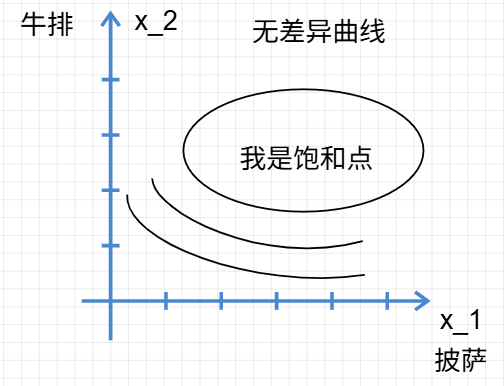

不过人们一般不会主动自愿选择过多的他们所消费的商品，我们也不常考虑这种情况。

- 离散商品

实际上，商品的购买并不是总是连续的[^10]，我们有时候需要考虑离散变量形成的商品购买。

不过，实际上和连续商品还是一致的，只不过图像变成了离散的点。换言之，离散商品的无差异曲线是无差异的点集，点集数量足够大时可以视为近似曲线，我们的后续分析也默认商品连续。

### 良态偏好与单调性

为了方便我们的模型构建，一些必要的假设是很重要的。

1. 我们假设消费者在我们的模型中购买的是 goods 商品而不是 bads 厌恶品；[^11]
2. 我们假设无差异曲线是单调的，且是下凸的；

无差异曲线的一些经济学意义：

- 单调性：

消费者希望多多益善，也就是说，两种商品都要尽可能多，达到一种均衡取舍。所以，当某种商品过多而另一种减少的时候偏好不会增加。所以无差异曲线必然是递减的。

- 凹凸性：

那么，消费者选择 $(x_a, y_a),(x_b,y_b)$ 必然没有 $(\frac{x_a + x_b}{2}, \frac{y_a + y_b}2)$ 的偏好高。换句话说，消费束的图像一般是凸的。这称为凸偏好。

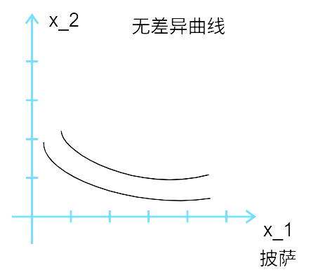

这样的称为良态偏好。

当然了，不是凸的偏好，统称非凸偏好。如果所有点都满足非凸的条件，那么它就已经变成凹偏好。这种情况下，消费者对两种商品都有偏好，但是极其厌恶把两种放到一起，这导致两种都多得的时候偏好反而和没多得的时候相近。例如，意大利人购买菠萝披萨之类。

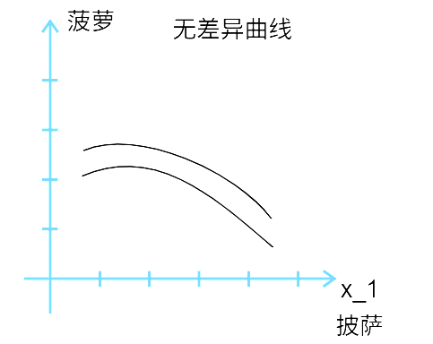

这是一个典型的凹偏好。特别的，完全替代品的偏好不是凹的，是非严格凸的凸偏好。

### 边际替代率

> 边际替代率是在维持效用水平不变的前提下，消费者愿意用一单位商品1交换商品2的数量。

边际替代率是极其重要的微观经济学观点。简而言之，无差异曲线的斜率就是边际替代率(Marginal Rate of Substitution，MRS)，它的经济学意义代表使用商品A替换得到商品B的比率。对于良态偏好边际替代率一般是负数，其绝对值是交换比率。实际中我们常取绝对值分析替代关系。
$$
F(x_1,x_2) = 0 \Rightarrow \frac{\partial x_2}{\partial x_1}
$$
范立安在这里使用了老套的变化量解释法，感兴趣的同志可以一看。

边际替代率解释了无差异曲线的斜率意义，代表着两种商品的交换规律，换言之，代表了消费者在该**点**的支付意愿。这暗示着消费者行为的另一个重要参量，边际效用的存在，我们在后面会继续介绍。

## 效用

有些古典学家轻蔑地认为*效用就是衡量个人快乐的数学测度*，在经济学中，效用就是衡量消费束偏好程度的数学基数。

简而言之，效用**唯一**的特征与作用就是为给出的偏好消费束排序。效用函数的数值，至少在我们的基数效用理论中，除了排序的意义没有其他的经济学意义，因此，效用被称作**序数效用**。

例如，三个消费束 $X,Y,Z$ 是三个消费束，存在偏好关系：$X \prec Y \prec Z$。那么就必然可以通过某种计算方法分配效用函数：$U(x)<U(Y)<U(Z)$

|      | $U_1$ | $U_2$ | $U_3$  |
| ---- | ----- | ----- | ------ |
| $X$  | 1     | 100   | -39.3  |
| $Y$  | 2     | 240   | -12.32 |
| $Z$  | 3     | 332   | 23.1   |

上述三种效用赋值方式在数学意义上都是合理的[^12]，因为在我们的研究中，只对消费者的消费束排序感兴趣，所以只考虑三者之间的大小顺序[^13]。

### 基数效用

实际上，亦有学派将基数的数值赋有意义，这些理论被称为**基数效用**理论。

该学派的误区在于，机械地将其他学派中的经验照搬到经济学中，误认为偏好是一个可量化的具体量，忽视了其抽象性。我们怎么可以说消费者A喜欢消费束X是消费者B的两倍呢？这种两倍指的是什么意义？

没有令人信服的方法指代奇数效用。也许更先进的方法会出现，但是我们在此坚持完全序数效用。

### 效用函数的构造

假如某人的偏好是 $A \prec B \prec C \prec A$，那么就很显然不能映射到数据了。所以我们假设偏好都是具有传递性的好“偏好”。对这样的偏好来说一般是能够找到相应的效用函数的，下面给出一个示例。

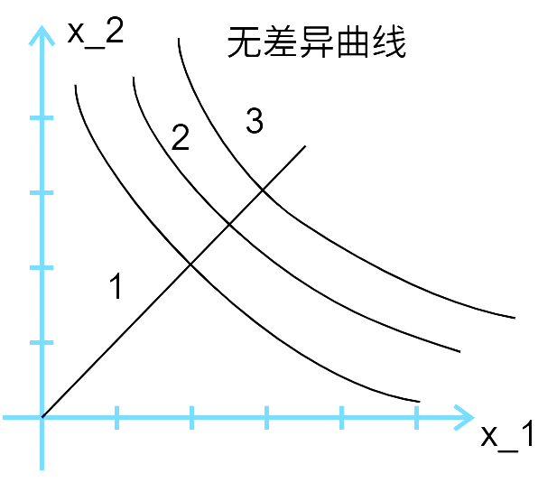

从原点引出一条直线[^14]，依次相交得到的就是效用的次序。

同样的，使用曲线，弧线各种任意“合理”的方法都能得到效用函数。

### 几个重要的效用函数示例

效用函数的数值没有实际含义，不代表效用函数没有数值及其函数表达式。

- 示例：效用到无差异曲线

假设有一个效用函数是 $u(x_1, x_2) = x_1 \cdot x_2$

典型的就是 $u(x_1, x_2) = k$，这暗示 $x_2 = \frac{k}{x_1}$ ；同时给出一个同意义的效用函数 $v(x_1, x_2)= u^2(x_1, x_2)=x^2_1x^2_2$。

所以无差异曲线就是 $x_2 = \frac{k}{x_1}$

因此效用函数很容易得到无差异曲线，然而无差异曲线如何到效用函数？

1. 数学方法：找到无差异曲线对应的常量
2. 经济方法：找到实际意义上的经济学常量

- 完全替代：

完全替代函数的无差异曲线效用方程是： 
$$
k_1 x_1 + k_2 x_2 = K
$$
没错，这里 $K$ 的是经济学意义就是效用。

- 完全互补：

完全互补函数的无差异曲线效用方程：
$$
u(x_1,x_2)=\min{\{x_1, x_2\}}
$$

!!! tip
	注意，消费束的定义会改变效用函数的形式，详见脚注

这是因为两种商品多了一种是无益的。效用只和最低的个体量挂钩[^15]。

- 拟线性偏好

并非所有无差异曲线都能用线性方式表示出来。不过，假设无差异曲线具有一点线性性质，即整个一组曲线都可以通过平移得到，那么称为**拟线性偏好**
$$
x_2 = k - v(x_1)
$$
拟线性偏好不太符合现实，但是非常容易分析。

- 柯布-道格拉斯偏好

另一种普遍使用的函数是柯布道格拉斯效用函数
$$
u(x_1,x_2) = x_1 ^c x ^d_2
$$
其中 $c,d$ 都是消费者偏好的正数[^16]，是消费者消费偏好的反映。

柯布道格拉斯函数假定消费者的效用分布是服从幂函数关系，这在普通增长的模型中很实用。

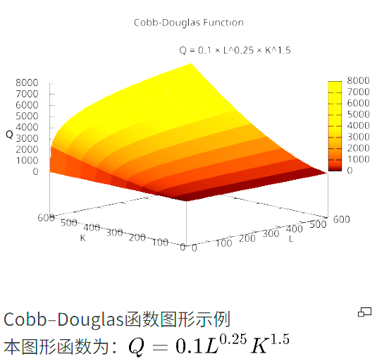

图片来自Wikipedia。

柯布函数的变换确切表示一个偏好，考察这种变换对我们十分有益。

对偏好函数取对数得到：
$$
v(x_1,x_2)=\ln(x^c_1x_2^d)=c\ln x_1+d\ln x_2
$$
对偏好函数取幂得到：
$$
v(x_1,x_2)=x_1^{\frac{c}{c+d}}x_2^{\frac{d}{c+d}}
$$
这使得幂和为1，后面会证明这个函数是有用的。

### 边际效用

边际效用是本章最后一个知识点。边际在经济学中意味着极小范围内的变化率，也就是导数。**边际效用**(Marginal Utility)就是在极小的区间内，消费束的组织改变引起的效用变化率。由于效用本身是两个自变量 $x_1,x_2$ 的函数，将边际效用定义为
$$
\text{MU}_1=\frac{\Delta U}{\Delta x_1}
$$
或者更加严谨：
$$
\text{MU}_1 = \frac{\partial U}{\partial x_1}
$$

### 边际效用与边际替代率

考虑到边际替代率的公式是：
$$
\text{MRS}	 = \frac{\Delta x_2}{\Delta x_1} = -\frac{\text{MU}_1}{\text{MU}_2}
$$
这也说明了效用函数的形式不改变边际替代率。

我们已经知道
$$
\text{MU}_i = \frac{\partial U(x_1,x_2)}{\partial x_i}
$$
在连续的商品分布中成立，则：
$$
du = \frac{\partial U}{\partial x_1} dx_1 + \frac{\partial U}{\partial x_2} dx_2
$$
由隐函数导数的知识得知边际替代率与边际效用的关系[^17]。

## 选择

我们已经了解了消费者对消费品的偏好如何，也了解了消费者的预算约束如何影响消费者的消费选择。我们接下来将研究消费者如何基于偏好选择最大利益化的消费。

首先，我们的消费模型将在良态偏好中，且只专注于预算约束中相关的消费束。所以消费者预算线之下的部分将会被忽视。

如图，是一种最典型的消费者选择示意图。

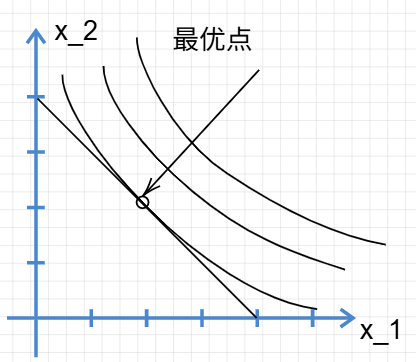

图中消费者预算曲线代表着消费者预计能够购买的消费束，相切的无差异曲线代表着消费者恰好能够购买到的最大的无差异曲线。若相割，则证明导数值有更大的变化，函数值可以在小邻域内变化的更大。

然而实际情况并非常常如此，无差异曲线并非总是如此光滑。

例外：

1. 无差异曲线无切线：

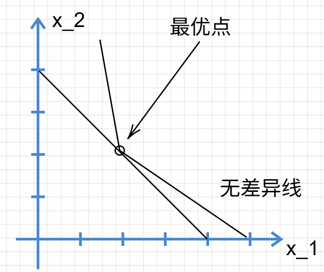

这种情况在经济学中没什么意义，无非是增加了数学上的繁琐性。

2. 无差异曲线与坐标轴相交：

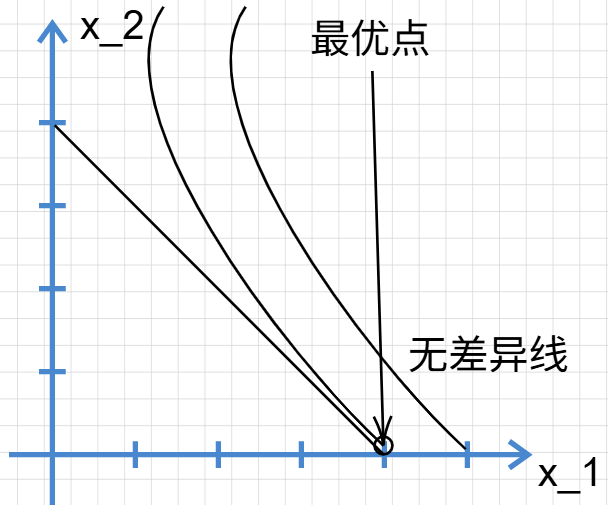

无差异曲线虽然没有与预算线相切，但是由于坐标轴的边界限制，最后仍然在此处得到最优。我们将这种称为边界最优，而本节开始的最优称为内部最优。

需要注意，相切也并非必然导致最大化的效用：

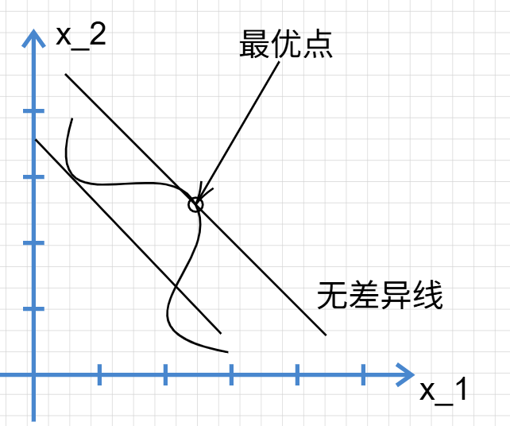

相切仅仅是一个必要条件。

### 各个典型偏好中的最优化

详见范里安P51-P53

[^1]: 在消费者日常消费的情景中

[^2]: 否则消费者会陷入混乱。当然，某些消费者可能会觉得自己买的永远是最差的。
[^3]: 否则消费者就不知道哪个消费束对自己是最好的，即选择困难
[^4]: 即Indifferent。
[^5]: 需特别注意消费束的单位定义：若将 $x_2$ 设定为 “2 只红铅笔”、$x_1$ 设定为 “1 只白铅笔”，无差异曲线斜率会变为 - 2。为简化分析，此处严格假定消费束中商品的单位均为现实中公认的 “单个个体”（如 1 只红铅笔、1 只白铅笔）
[^6]: 这类商品单独使用的价值与可能性极低，更贴切的例子并非 “不单独售卖” 的商品，而是 “必须按固定比例搭配使用” 的商品，例如油动汽车与汽油、打印机与专用墨盒。
[^7]: 范里安举的例子是凤尾鱼与香肠，可惜很多人连凤尾鱼是什么都不知道，我们姑且替换为鸡肉和苦瓜的例子。
[^8]: 亦称 “饱和偏好”，为避免翻译歧义，标注其英文为 “Satiation”。
[^9]: 确实很“饱”和。
[^10]: 连续函数是我们在微积分和实分析理论中常接触的，自然更方便解决。
[^11]: 即模型聚焦于 “偏好品”（goods）而非 “厌恶品”（bads），核心假设是 “多多益善”：在预算允许的范围内，消费者倾向于增加任意商品的消费量以提升满足感。如果你的每一个模型中消费者都达到餍足，那么经济学将会变成一场人道主义灾难。
[^12]: 序数效用理论中，效用函数的具体数值无实际经济学意义，仅需关注其排序逻辑
[^13]: 正单调变换不改变三者的大小顺序，负单调不改变遍历顺序，但是会颠倒之，不被接受。所以本质上，只要存在一个确定的排序就可以映射到无限个排序。
[^14]: 实际上是射线，仅包含第一象限的部分
[^15]: 完全互补品的效用函数需与商品的 “使用比例” 匹配。函数形式应当是 $u(x_1,x_2) = \min\{ax_1,bx_2\}$，例如一块镜片和一个眼镜框作为单位时函数形式是 $u(x_1,x_2) = \min\{x_1,x_2\}$，考察两块镜片和一个镜框做函数的时候就要改为  $u(x_1,x_2) = \min\{x_1,1/2 * x_2\}$
[^16]: 作者注：柯布 - 道格拉斯函数由数学家查尔斯・柯布（阿默斯特学院）与经济学家保罗・道格拉斯（曾执教于芝加哥大学，后任美国参议员）共同提出，最初用于描述生产行为（如资本与劳动的产出关系），后被广泛应用于消费者偏好分析。
[^17]: 另一种方法是将 $x_1$ 视为 $x_2$ 的函数
