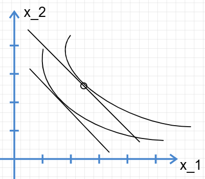
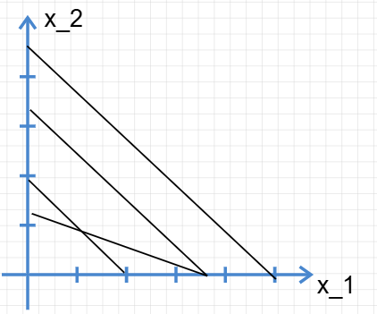
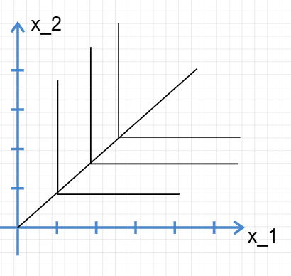

# 微观经济学-消费者理论III

## 显示偏好

偏好是不能直接计算的，所以我们根据消费者的实际选择显示的偏好计算消费者的偏好，这称为显示偏好。

显示偏好的原理很简单：设 $(x_1,x_2)$ 和 $(y_1,y_2)$ 是消费者能够购买的两个消费束，前者是被选择的消费束，满足 $p_1x_1 + p_2x_2 \geq p_1 y_1 + p_2 y_2$，假若消费者总是在他能够购买的消费束中选择它最好的消费束，则消费者有 $Y \prec X$ 。

很显然，显示偏好是可传递的。

多个消费束的选择会在无差异曲线中规划出对应“好”与“差”消费束区域。通过观察选择，做出偏好的推测，这称为恢复偏好。

!!! tip "显示偏好弱公里"
	若已知 $A$ 显示偏好于 $B$ 则不能说消费者偏好 $B$

!!! tip "显示偏好强公里"
	若已知 $A$ 直接或间接显示偏好于 $B$，则不能说消费者偏好 $B$

## 需求

消费者的需求函数刻画着每种商品的需求量与价格、收入的关系，记作：
$$
x_1 = x_1 (p_1, p_2,m)\\
x_2 = x_2 (p_1, p_2,m)
$$
范里安指出：

只有两种东西在我们的模型中影响最优选择，即价格和收入。因此，消费者理论中比较静态问题所要研究的就是：当价格和收入变动时需求如何变动

### 正常商品与低档商品

我们已经知道，消费者所谓的最优选择在预算线与无差异曲线相切时所取得。考虑到多多益善的原则，消费者收入增加应当与更高的效用函数相切，直观上看似乎收入越多，商品的消费也增多。这称为**正常商品** 。

然而,如若考虑如下无差异曲线则:

随着收入增加，商品2的消费量反而减少了。这种商品称为低档商品。

简而言之，正常商品数量变动总是与收入变动方向保持一致：

$$
\frac{\Delta x_1}{\Delta m} >0
$$

### 收入提供曲线

将所有的最优点连接起来，得到的 $x_1 - x_2$ 曲线就是收入提供曲线。在商品1，2的价格不变化的情况下，对应的 $x_1 -m $ 曲线就是一条恩格尔曲线。

#### 实例

完全替代品的收入提供曲线。对于 $p_1 < p_2 $ 完全替代品最优点总是在角点。恩格尔曲线是一条直线。

完全互补品的收入提供曲线。恩格尔曲线仍然是一条直线。

!!! note
	使用代数方法，柯布道格拉斯偏好的也是一条直线，恩格尔曲线是斜率为 $\frac{p}{a}$，其中 $a$ 是指数差。
\
特别的，我们将总是偏好 $(k x_1, k x_2)$ 的偏好称为**相似偏好**。

### 需求曲线

我们不仅需要研究消费和收入的关系，我们更需要研究消费额与消费者真实需求的关系。取价格2为恒定值，改变价格1（即旋转曲线）得到的交点组成新的价格提供曲线。对应得到需求曲线。

#### 实例

#### 替代和互补

商品1的需求函数是商品1价格和商品2价格的函数，记作 $x_1(p_1, p_2, m)$。商品2价格上升，商品1购买增加，这时就是替代品：
$$
\frac{\Delta x_1}{\Delta p_2}>0
$$

反之，商品2价格上升商品1需求下降，这时就是互补怕：
$$
\frac{\Delta x_1}{\Delta p_2} <0
$$

#### 反需求函数

需求函数的反函数，实际上具有其经济学意义。即对于某个消费束，消费者愿意支付的货币量。